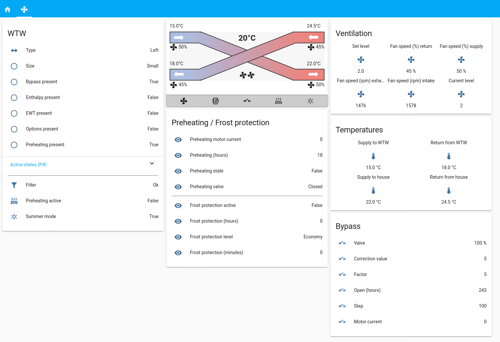

# WHR 930
Manage a Storkair WHR 930 system using MQTT.

See also my [blog posting](https://blog.mosibi.nl/domotica/2017/12/31/control-a-storkair-zehnder-whr-930-ventilation-unit-using-mqtt.html) I wrote about the WHR 930


## Installation and configuration
This (python) code uses some libraries that need to be installed. Assuming you are using a Raspberry Pi or another Debian based Linux distribution, the following command's will install the dependencies

```lang=shell
$ sudo apt-get install python3-serial python3-pip python3-yaml
$ sudo pip3 install paho-mqtt
````

After installing the dependencies, clone this repository and modify the MQTT settings in src/whr930.py and run `sudo make install`.

```lang=shell
$ git clone https://github.com/Mosibi/whr_930.git
$ vi src/whr930.py
$ sudo make install
$ sudo systemctl start whr930.service
```

## Home Assistant configuration



Copy src/wtw.yaml in the config/includes directory of your home assistant installation and modify the file configuration yaml to include the following:

```lang=yaml

homeassistant:
  < ... your other config settings under homeassistant ... >
  packages:
    wtw: !include includes/wtw.yaml

```

Add the content of src/lovelace.yaml to your current dashboard configuration, it will place the WTW configuration in a seperate tab.


### External resources
I've extended the possibilities of the standard Lovelace interface using multiple plugins. Visit those pages and follow the installation instructions for them:

* [lovelace-wtw](https://github.com/Mosibi/lovelace-wtw/tree/mosibi) : Nice graphical flow overview, created by [Tim Jongsma](https://github.com/timjong93)
* [lovelace-fold-entity-row](https://github.com/thomasloven/lovelace-fold-entity-row) : Use to fold in the P status overview

*Note: the lovelace-wtw repo links points to my own fork of Tim's code. I created a pull request for his version to make it compatible with my code. When that PR is accepted, I will use his version.*