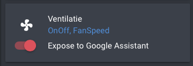

# WHR 930

Manage a Storkair WHR 930 system using MQTT.

See also my [blog posting](https://blog.mosibi.nl/domotica/2017/12/31/control-a-storkair-zehnder-whr-930-ventilation-unit-using-mqtt.html) I wrote about the WHR 930

## Installation

This (python) code uses some libraries that need to be installed. Assuming you are using a Raspberry Pi or another Debian based Linux distribution, the following command's will clone the repository and install the required dependencies:

For installation, you can choose between installing the bridge as a system service or use Docker.

### Installing as system service

Follow these steps to clone the repository, install required dependencies, configure the service and install it:

```bash
git clone https://github.com/Mosibi/whr_930.git
sudo apt-get install python3-serial python3-pip python3-yaml
cd whr_930
vi src/config.yaml
sudo pip3 install -r src/requirements.txt
sudo make install
sudo systemctl start whr930.service
```

### Using Docker

Follow these steps to clone the repository, configure the service and run it through Docker.

```bash
git clone https://github.com/Mosibi/whr_930.git
cd whr_930
vi src/config.yaml
docker build -t wtw-bridge .
docker start wtw-bridge
```

Or include it in a `docker-compose.yml` as follows:

```yaml
wtw-bridge:
  build: ./whr_930
  restart: always
  devices:
    - /dev/ttyUSB0
```

## Home Assistant configuration


Copy src/wtw.yaml in the config/includes directory of your home assistant installation and modify the file configuration yaml to include the following:

```lang=yaml

homeassistant:
  < ... your other config settings under homeassistant ... >
  packages:
    wtw: !include includes/wtw.yaml

```

Add the content of src/lovelace.yaml to your current dashboard configuration, it will place the WTW configuration in a separate tab.

### Voice control integration

When you integrate Amazon Alexa or Google Home or some other voice control method, it is possible to set the ventilation to a certain level using a voice command. In includes/wtw.yaml a virtual [fan](https://www.home-assistant.io/integrations/fan.mqtt) is created which can be called from the [emulated_hue](https://www.home-assistant.io/integrations/emulated_hue/) component or [Home Assistant Cloud](https://www.nabucasa.com/) to execute the voice command.

To use with the emulated_hue component, add the following to your configuration.yaml and let Alexa do a discovery of the devices (_Alexa discover devices_). For Google Home users it may work, but there is a big warning on the emulated_hue page which states that _new users_ have to use the [google_assistant](https://www.home-assistant.io/integrations/google_assistant/) or the [Home Assistant Cloud](https://www.home-assistant.io/integrations/cloud) integration

```lang=yaml
emulated_hue:
  advertise_ip: <ip address>
  expose_by_default: false
  exposed_domains:
    - fan
  entities:
    fan.ventilation:
      hidden: false
```

[iamhaller](https://github.com/iamhaller) learned me that with Home Assistant Cloud you have to configure Google Home or Alexa after which you can expose the virtual fan.


### External resources

I've extended the possibilities of the standard Lovelace interface using multiple plugins. Visit those pages and follow the installation instructions for them:

- [lovelace-wtw](https://github.com/Mosibi/lovelace-wtw/tree/mosibi) : Nice graphical flow overview, created by [Tim Jongsma](https://github.com/timjong93)
- [lovelace-fold-entity-row](https://github.com/thomasloven/lovelace-fold-entity-row) : Use to fold in the P status overview

_Note: the lovelace-wtw repo links points to my own fork of Tim's code. I created a pull request for his version to make it compatible with my code. When that PR is accepted, I will use his version._
